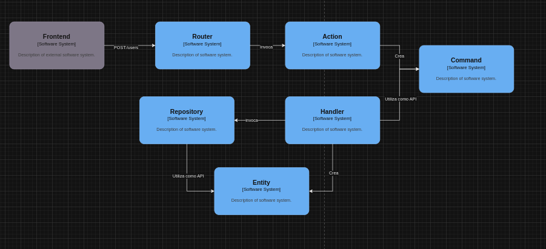

<p align="center"><a href="https://laravel.com" target="_blank"></a></p>

--------------------------------------
## About the application
This is a simple Rest API that consumes Giphy's public API. The API is based on PHP8.2 and Laravel11.22.0, with Eloquent and MySQL and implements Oauth2.0 using Laravel Passport.

--------------------------------------
## How to download and install the project

--------------------------------------
### Dependencies
First that all you need check if you have installed the followed dependencies:
- The following instructions and documentations that we share with you are for Linux based systems, but you can get the docs for Windows or macOS in the same websites. 
- [Git (official)](https://git-scm.com/downloads) or [Git (Digital Ocean)](https://www.digitalocean.com/community/tutorials/how-to-install-git-on-ubuntu-22-04): We have to use Git for branch managing and versioning.
- [Docker (Digital Ocean)](https://www.digitalocean.com/community/tutorials/how-to-install-and-use-docker-on-ubuntu-20-04) and [Docker compose (Digital Ocean)](https://www.digitalocean.com/community/tutorials/how-to-install-and-use-docker-compose-on-ubuntu-22-04): We have to use Docker and Docker Compose for container managing without operative systems limitations.
- [Composer (Digital Ocean)](https://www.digitalocean.com/community/tutorials/how-to-install-and-use-composer-on-ubuntu-20-04): We have to use Composer for php dependencies managing
- We have to install php 8.2 and some other php packages, just need to open a new terminal and run the following command:`sudo apt install php8.2 php8.2-cli php8.2-common php8.2-mbstring php8.2-xml php8.2-mysql php8.2-zip php8.2-curl php8.2-gd php8.2-bcmath php8.2-fpm`
------------------------
### Repository cloning
Open a new terminal (linux/macOS) or a GitBash or PowerShell (Windows) and clone the repository with one of the following commands:
- `git@github.com:MartinMontanari/giphy-api-wrapper.git` / if you have configured the SSH key in your GitHub account.
- `https://github.com/MartinMontanari/giphy-api-wrapper.git` / if you haven't configured the SSH key in your GitHub account you could clone it by HTTPS and use your credentials.
- `https://github.com/MartinMontanari/giphy-api-wrapper` / if you haven't configured a GitHub account you should download the code as ZIP file clicking the green button <> Code.
------------------------
### Running the application

- Hint: all the following commands are available for `terminal(Mac,Linux)` and `PowerShell(Windows)`.

1 - Go to the folder where you're downloaded/cloned the application. Stay in the root folder and open a new `terminal/PowerShell`.

2 - You should need to create a `.env` file at the root folder and just copy/paste the `.env.example` data, run ➜ `cp .env.example .env`. 

3 - Install the dependencies, run ➜ `composer install`.

4 - Run the Docker containers, we recommend use [laravel/sail](https://laravel.com/docs/11.x/sail) for testing/dev environment, run ➜  `./vendor/bin/sail up`.

5 - Run the database migrations, run ➜  ` ./vendor/bin/sail artisan migrate`.

6 - Generate the base64 apikey, run ➜  `./vendor/bin/sail artisan key:generate`.

7 - Install passport and generate the secrets and clients, run ➜  `./vendor/bin/sail artisan passport:install`.
- If the prompt ask you about the passport pending migrations, you should type `yes` and confirm.
- As result passport will create a new secret keys.
- IMPORTANT! Make sure that you have created the secret keys into the `/storage` folder. It will have the `.key` extension.

8 - Open a `laravel.test` docker container bash, run ➜ `./vendor/bin/sail exec laravel.test bash`.
The result will look like this ⬇
```
root@6a9362bf04f0:/var/www/html# 
```

9 - Configure permissions for the Docker container to allow it to handle the secrets, run ⬇ 
```
chmod 600 storage/oauth-private.key
chmod 644 storage/oauth-public.key
```

10 - You should need parse your `storage/oauth-public.key` to base64 to be able to decode the tokens. So, run ⬇
```
base64 storage/oauth-public.key
```
- Copy the generated base64 string and paste into your `.env` file replacing the value `PASSPORT_PUBLIC_KEY` (line:87).

11 - Now you could test the health check opening a web browser and go to the URL `http://localhost/api/health`, or just use the Postman collection provided (see the `Testing` section below).
The result will look like this ⬇
```
{
    "status": "Healthy",
    "message": "API is up and running!"
}
```
----------------------------------------------------------
## Testing

### Environment setup
- You should need to create a `.env.testing` file at the root folder and just copy/paste the `.env.example` data, run ➜ `cp .env.example .env.testing`.
- Only need set the `PASSPORT_PUBLIC_KEY` value, just copy/paste the base64 from your `.env` and it'll be works.

### How to run the feature tests
- run ➜ `/vendor/bin/sail artisan test`.

### How to test the API with PostMan
- In the folder `postman/` you have available a postman.json collection that you could import into your postman application and testing the endpoints.

----------------------------------------------------------
## Specifications

### Stack
- php8.2 + Laravel10 + Docker + MySQl + Eloquent + laravel/passport.
----------------------------------------------------------

### Entities Diagram


----------------------------------------------------------
### Architecture workflow


----------------------------------------------------------
### System Architecture
The logical layer organization is based on Onion Architecture:


Sources for Architecture, Concepts, and Best Practices:
https://martinfowler.com/eaaCatalog/ (Concepts for ORM DataMapper vs ActiveRecord)

https://domainlanguage.com/ddd/ (DDD Concepts such as: Entities / Value Objects / Services / Commands / Shared-Kernel / Repositories)

The main blue book contains all the relevant concepts used here as best practices to focus on the domain and create the most decoupled and correct systems possible.

A summary of this free book is available at:

http://domainlanguage.com/wp-content/uploads/2016/05/DDD_Reference_2015-03.pdf

Dependency Injection / Inversion of Control
To maintain low coupling and adhere to the architecture, dependency injection and, in general, an IoC (Inversion of Control) container are necessary, as outlined in the SOLID principles. This helps us use interfaces/contracts, which are injected by a cross-cutting infrastructure component that resolves the necessary dependencies for us.

--------------------------------------------------

### Project structure

```
project-root/
.
├── app
│   ├── application
│   │   ├── commandHandlers
│   │   │   ├── Auth
│   │   │   │   ├── LoginOauthClientHandler.php
│   │   │   │   └── RegisterOauthClientHandler.php
│   │   │   └── favorites
│   │   │       └── NewFavoriteGifHandler.php
│   │   ├── commands
│   │   │   ├── Auth
│   │   │   │   ├── LoginOauthClientCommand.php
│   │   │   │   └── RegisterOauthClientCommand.php
│   │   │   └── favorites
│   │   │       └── NewFavoriteGifCommand.php
│   │   ├── queries
│   │   │   └── Gifs
│   │   │       ├── GetGifsBySpecificationQuery.php
│   │   │       └── GetGifByIdQuery.php
│   │   └── queryHandlers
│   │       └── Gifs
│   │           ├── GetGifByIdHandler.php
│   │           └── GetGifsBySpecificationHandler.php
│   ├── domain
│   │   └── Models
│   │       ├── Favorite.php
│   │       ├── InteractionHistory.php
│   │       └── User.php
│   └── infrastructure
│       ├── Console
│       │   └── Kernel.php
│       ├── Exceptions
│       │   ├── BadRequestException.php
│       │   ├── Handler.php
│       │   ├── NotFoundException.php
│       │   ├── RepositoryException.php
│       │   └── UnauthorizedException.php
│       ├── Http
│       │   ├── Controllers
│       │   │   ├── Auth
│       │   │   │   ├── LoginOauthClientAction.php
│       │   │   │   └── RegisterOauthClientAction.php
│       │   │   ├── Controller.php
│       │   │   ├── favorites
│       │   │   │   └── NewFavoriteGifAction.php
│       │   │   ├── Gifs
│       │   │   │   ├── GetGifByIdAction.php
│       │   │   │   └── GetGifsBySpecificationAction.php
│       │   │   ├── Health
│       │   │   │   └── HealthCheckAction.php
│       │   │   └── LogController.php
│       │   ├── enums
│       │   │   └── HttpCodes.php
│       │   ├── Kernel.php
│       │   ├── Middleware
│       │   │   ├── Authenticate.php
│       │   │   ├── CustomOauthAuthenticator.php
│       │   │   ├── EncryptCookies.php
│       │   │   ├── InteractionHistoryMiddleware.php
│       │   │   ├── PreventRequestsDuringMaintenance.php
│       │   │   ├── RedirectIfAuthenticated.php
│       │   │   ├── TrimStrings.php
│       │   │   ├── TrustHosts.php
│       │   │   ├── TrustProxies.php
│       │   │   ├── ValidateSignature.php
│       │   │   └── VerifyCsrfToken.php
│       │   └── validators
│       │       ├── Auth
│       │       │   ├── LoginOauthClientValidator.php
│       │       │   └── RegisterOauthClientValidator.php
│       │       ├── favorites
│       │       │   └── NewFavoriteGifValidator.php
│       │       └── Gifs
│       │           ├── GetGifByIdValidator.php
│       │           └── GetGifsBySpecificationValidator.php
│       ├── Providers
│       │   ├── AppServiceProvider.php
│       │   ├── AuthServiceProvider.php
│       │   ├── BroadcastServiceProvider.php
│       │   ├── EventServiceProvider.php
│       │   └── RouteServiceProvider.php
│       ├── repositories
│       │   ├── FavoriteRepository.php
│       │   ├── InteractionHistoryRepository.php
│       │   └── UserRepository.php
│       └── services
│           ├── AccessTokenService.php
│           ├── GiphyService.php
│           ├── InteractionHistoryService.php
│           ├── OauthService.php
│           └── UserService.php
├── bootstrap/
├── config/
├── database/
│   ├── factories/
│   ├── migrations/
│   └── seeders/
├── routes/
│   ├── api.php
│   └── channels.php
├── storage/
├── tests/
├── vendor/
├── .env
├── artisan
├── composer.json
└── phpunit.xml
```


The API is licenced by [MIT license](https://opensource.org/licenses/MIT).
